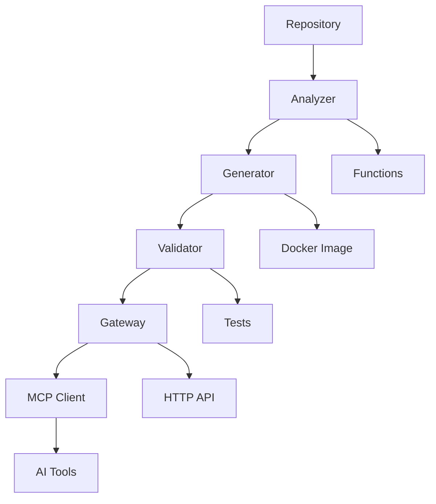

# 🚀 Maverick-MCP: Intelligent Repository Conversion Platform

**Transform any codebase into AI-accessible tools with zero manual setup**

Maverick-MCP is a unified MCP (Model Context Protocol) API gateway that automatically converts any repository into containerized MCP servers through intelligent AST analysis, automated Docker containerization, and comprehensive validation.

[](https://github.com/loomworks3/maverick-mcp)
[](https://www.docker.com/)
[](https://modelcontextprotocol.io/)
[](https://opensource.org/licenses/MIT)

## ✨ Key Features

### 🤖 **Intelligent Repository Analysis**
- **AST-based code analysis** for Python, JavaScript, and Go
- **Function extraction** with parameter analysis and security scanning
- **MCP tool candidate scoring** algorithm (0-10 scale)
- **Documentation parsing** and tool purpose inference

### 🐳 **Automated Dockerization**
- **Template-based container generation** with dependency resolution
- **Multi-language support** (Python, JavaScript, Go)
- **MCP server wrapper generation** with async support
- **Security-aware containers** with non-root users

### 🔒 **Security Assessment**
- **Pattern scanning** with risk classification system
- **Interactive approval workflows** with traffic light system
- **User-controlled deployment** with detailed security warnings
- **Dangerous code detection** before conversion

### ✅ **Comprehensive Testing**
- **Automated validation framework** with multi-phase testing
- **MCP protocol compliance** (JSON-RPC 2.0 specification)
- **Tool functionality testing** with parameter validation
- **Performance benchmarking** and deployment recommendations

### 📚 **Rich Documentation**
- **Enhanced tool descriptions** with comprehensive usage guides
- **4 practical examples** per tool with expected outputs
- **Performance optimization notes** and integration guidance
- **Embedded MCP documentation server** with protocol references

### ⚡ **Production-Ready Gateway**
- **On-demand scaling** - containers spawn only when needed
- **Automatic cleanup** - idle timeout with resource management
- **Unified HTTP API** - single endpoint for all converted repositories
- **Systemd integration** - auto-start service with failure recovery

## 🚦 Quick Start

### 1. **System Requirements**
- Docker and Docker Compose
- Python 3.8+ with pip
- Linux/macOS (systemd for auto-start)

### 2. **Installation (Recommended)**
```bash
# Clone the repository
git clone https://github.com/loomworks3/maverick-mcp.git
cd maverick-mcp

# Install as system service (auto-starts on boot)
chmod +x .dev/scripts/install-autostart.sh
.dev/scripts/install-autostart.sh
```

This will:
- ✅ Build all required Docker images  
- ✅ Install systemd service
- ✅ Start the gateway automatically on port 8000
- ✅ Enable auto-start on system boot

### 3. **Connect Claude Code**
```bash
# Add Maverick-MCP to Claude Code
claude mcp add maverick-mcp --transport http --url http://localhost:8000/mcp
```

### 4. **Convert Your First Repository**
```bash
# Analyze any repository for MCP potential
python .dev/tools/analyze_repo.py /path/to/your/repository

# Generate MCP server with interactive approval
python .dev/tools/generate_docker_server.py --interactive --repo /path/to/your/repository

# Validate the generated server
python .dev/tools/validation_pipeline.py your-server-name

# Add to gateway configuration and restart
# Edit servers.yaml and restart the gateway
```

## 📁 Project Structure

```
maverick-mcp/
├── 📋 README.md                    # This file - project documentation
├── ⚙️ docker-compose.yml          # Container orchestration
├── 🐳 Dockerfile                  # Gateway container definition
├── 🌐 gateway.py                  # Main FastMCP HTTP server
├── 📦 requirements.txt            # Python dependencies
├── 🗂️ servers.yaml                # MCP server registry configuration
├── 📝 .env.example               # Environment variable template
├── 🚫 .gitignore                 # Version control exclusions
│
├── 🔍 analyzer/                   # Repository analysis engine (2,171+ lines)
├── 🐳 dockerfile_generator/       # Docker generation system (2,546+ lines)
├── 🌐 servers/                    # MCP server implementations
│   ├── context7/                  # Documentation retrieval service
│   └── mcp-docs/                  # MCP protocol documentation hub
└── 🧪 tests/                      # Comprehensive test suite
```

**All development files are organized in `.dev/` (gitignored for clean public repo)**

## 🛠️ Complete Repository Conversion Workflow

Maverick-MCP provides a complete end-to-end pipeline from repository to deployed MCP server:

### **Phase 1: Analysis** 📊
```bash
python .dev/tools/analyze_repo.py /path/to/repository
```
- AST-based function extraction and security scanning
- Tool candidate identification with scoring
- Documentation analysis for purpose inference
- Comprehensive security risk assessment

### **Phase 2: Generation** 🏗️
```bash
python .dev/tools/generate_docker_server.py --interactive
```
- Template-based Dockerfile and MCP server creation
- Multi-language dependency resolution
- Interactive security review and user approval
- Automated container build and tagging

### **Phase 3: Validation** ✅
```bash
python .dev/tools/validation_pipeline.py server-name
```
- Protocol compliance validation (JSON-RPC 2.0, MCP spec)
- Tool functionality testing with timeout handling
- Security assessment and performance benchmarking
- Pass/fail determination with detailed reporting

### **Phase 4: Deployment** 🚀
```bash
# Add to servers.yaml and restart gateway
sudo systemctl restart mcp-gateway
```
- Automatic container spawning on first tool request
- Rich tool descriptions exposed via unified API
- Monitoring and idle cleanup for resource efficiency

## 🌐 API Reference

### **Gateway Endpoints**

#### Tool Management
- **`GET /tools/list`** - List all available tools from all servers
- **`POST /tools/call`** - Execute a specific tool with parameters
- **`GET /servers/active`** - Show currently running servers
- **`POST /servers/stop`** - Manually stop a server

#### MCP Gateway Tools (via MCP clients like Claude Code)
- **`list_available_tools()`** - Discover all tools across servers
- **`execute_tool(server_id, tool_name, arguments)`** - Execute specific tool
- **`list_active_servers()`** - Show running container status
- **`stop_server(server_id)`** - Manual server lifecycle management

### **Example Usage**

```bash
# List all available tools
curl http://localhost:8000/tools/list

# Execute a tool
curl -X POST http://localhost:8000/tools/call \
  -H "Content-Type: application/json" \
  -d '{
    "server_id": "context7",
    "tool_name": "get_documentation",
    "arguments": {"library": "react", "topic": "hooks"}
  }'

# Check gateway health
curl http://localhost:8000/health
```

## ⚙️ Configuration

### **Server Registry (`servers.yaml`)**

Define MCP servers with rich metadata:

```yaml
your_server:
  image: "your-mcp-image"
  command: ["python", "server.py"]
  description: "Comprehensive server description"
  environment:
    API_KEY: "${YOUR_API_KEY}"
  idle_timeout: 300
  tools:
    - name: "your_tool"
      description: "Detailed tool description with examples"
      when_to_use: "Specific scenarios for tool usage"
      not_ideal_for: "Cases where tool is not recommended"
      performance_notes: "Optimization tips and caching behavior"
      examples:
        - description: "Example 1 scenario"
          parameters: {"param1": "value1"}
          expected_output: "Description of expected result"
      parameters:
        type: "object"
        properties:
          param1:
            type: "string"
            description: "Parameter description"
        required: ["param1"]
```

### **Environment Configuration**

Copy and customize environment variables:

```bash
cp .env.example .env
# Edit .env with your specific settings
```

Available environment variables:
- `LOG_LEVEL` - Logging verbosity (DEBUG, INFO, WARNING, ERROR)
- `GATEWAY_PORT` - HTTP server port (default: 8000)
- `DEFAULT_IDLE_TIMEOUT` - Container idle timeout in seconds (default: 300)

## 🏗️ Architecture



### **Communication Flow**
```
Claude Code Client → HTTP → Gateway (FastMCP) → STDIO → Docker Container (MCP Server) → Tools
                   ←      ←                   ←       ←                              ←
```

### **Key Components**
1. **Repository Analyzer** - AST-based function extraction with security scanning
2. **Dockerfile Generator** - Template-based multi-language containerization
3. **Validation Pipeline** - Comprehensive MCP protocol and functionality testing
4. **Gateway Process** - FastMCP HTTP server with container orchestration
5. **Docker Bridge** - STDIO communication with containerized MCP servers
6. **Idle Monitor** - Background task for resource cleanup and optimization

## 🔧 Development & Customization

### **Adding Custom MCP Servers**

1. **Create your MCP server** (any language with MCP protocol support)
2. **Use the conversion pipeline** or manually add to `servers.yaml`
3. **Build and tag Docker image**
4. **Restart gateway** to load new configuration

### **Manual Server Structure**
```
servers/your-server/
├── Dockerfile           # Container definition
├── server.py           # MCP server implementation
├── requirements.txt    # Dependencies
└── README.md          # Server documentation
```

### **Development Mode**
```bash
# Install dependencies
pip install -r requirements.txt

# Run gateway in development mode
LOG_LEVEL=DEBUG python gateway.py

# Access development tools
ls .dev/tools/          # Repository conversion tools
ls .dev/research/       # Research documentation
ls .dev/scripts/        # Setup and utility scripts
```

## 🧪 Testing & Validation

### **Built-in Test Suite**
```bash
# Run comprehensive test suite
python -m pytest tests/

# Test specific functionality
python tests/test_mcp_protocol.py      # Protocol compliance
python tests/test_tool_execution.py    # Tool functionality
python tests/test_analyzer.py          # Repository analysis
```

### **Validation Pipeline**
The integrated testing framework validates:
- ✅ MCP protocol compliance (JSON-RPC 2.0)
- ✅ Tool parameter validation and execution
- ✅ Security assessment and risk scoring
- ✅ Performance benchmarking
- ✅ Container lifecycle management

## 🚀 Production Deployment

### **System Service Management**
```bash
# Service status and control
sudo systemctl status mcp-gateway      # Check service status
sudo systemctl start mcp-gateway       # Start service
sudo systemctl stop mcp-gateway        # Stop service
sudo systemctl restart mcp-gateway     # Restart service
sudo journalctl -u mcp-gateway -f      # View logs

# Disable auto-start
sudo systemctl disable mcp-gateway
```

### **Production Considerations**
- 🔒 **Security**: Use environment variables for sensitive configuration
- 📊 **Monitoring**: Set appropriate resource limits in docker-compose.yml
- 📈 **Scaling**: Monitor container resource usage and performance
- 🌐 **Networking**: Consider using a reverse proxy (nginx/traefik)
- ⚡ **Reliability**: Service automatically restarts on failure and system boot
- 📝 **Logging**: Implement proper log aggregation and metrics collection

### **Uninstall Auto-Start Service**
```bash
# Remove systemd service and cleanup
.dev/scripts/uninstall-autostart.sh
```

## 🔍 Troubleshooting

### **Common Issues & Solutions**

| Issue | Possible Cause | Solution |
|-------|----------------|----------|
| Container won't start | Missing Docker image | Check image exists: `docker images` |
| STDIO communication fails | MCP protocol issues | Validate server with `.dev/tools/validation_pipeline.py` |
| Tools not discovered | servers.yaml syntax | Validate YAML syntax and tool definitions |
| Permission denied | Docker socket access | Ensure user is in docker group |
| High memory usage | Container resource limits | Set limits in docker-compose.yml |

### **Debug Mode**
```bash
# Enable detailed logging
export LOG_LEVEL=DEBUG
python gateway.py

# Container debugging
docker-compose logs -f mcp-gateway
docker exec -it mcp-gateway /bin/bash
```

### **Health Checks**
```bash
# Gateway health
curl http://localhost:8000/health

# Tool discovery test
curl http://localhost:8000/tools/list

# Server status
curl http://localhost:8000/servers/active
```

## 📊 Performance & Optimization

### **Resource Usage**
- **Memory**: ~50MB base + ~10-20MB per active server
- **CPU**: Low baseline, spikes during analysis and container startup
- **Disk**: ~100MB base + generated images and containers
- **Network**: HTTP API + Docker bridge communication

### **Optimization Tips**
- Use **idle timeouts** to clean up unused containers
- Set **resource limits** on containers to prevent resource exhaustion
- **Cache Docker images** to speed up container startup
- Monitor **container metrics** for performance bottlenecks

## 🤝 Contributing

We welcome contributions! Please see our development structure:

- **Core Features**: All major functionality is complete
- **Enhancement Areas**: Performance optimization, additional language support
- **Development Files**: Located in `.dev/` directory (gitignored)
- **Research Documentation**: Available in `.dev/research/`

### **Development Workflow**
1. Fork the repository
2. Create feature branch
3. Use the multiagent workflow system (see `.dev/workflow/RESUMEWORK.md`)
4. Submit pull request with comprehensive testing

## 📚 Documentation & Resources

### **Embedded Documentation**
Maverick-MCP includes a comprehensive documentation server accessible via the gateway:
- **MCP Protocol**: Complete specification and examples
- **FastMCP Framework**: Decorator patterns and deployment strategies
- **Repository Analysis**: Function extraction and security scanning guides

### **External Resources**
- [Model Context Protocol Specification](https://modelcontextprotocol.io/)
- [FastMCP Framework Documentation](https://github.com/jlowin/fastmcp)
- [Docker Best Practices](https://docs.docker.com/develop/best-practices/)

## 📄 License

MIT License - see [LICENSE](LICENSE) file for details.

## 🙏 Acknowledgments

Built with:
- [FastMCP](https://github.com/jlowin/fastmcp) - MCP framework
- [Docker](https://www.docker.com/) - Containerization
- [Model Context Protocol](https://modelcontextprotocol.io/) - AI tool integration standard

---

**🚀 Ready to transform your codebase into AI-accessible tools?**

Start with `python .dev/tools/analyze_repo.py /path/to/your/repository` and let Maverick-MCP handle the rest!